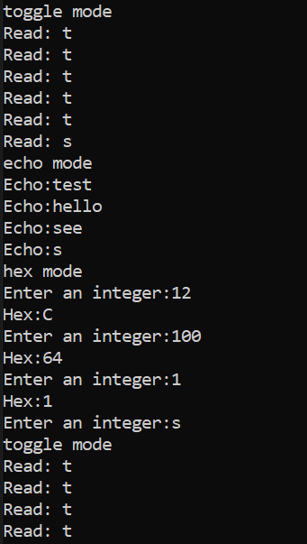

#  Console IO

Author: Allen Zou
Date: 2020-09-17
-----

## Summary
This program completes all the tasks in skill 6. This code was modified 
using the Blink.c file as a starting base due to it's existing configuation 
for flashing the LED on the ESP board. We also borrowed a hex conversion 
code snippit from:
(https://www.quora.com/How-can-I-convert-from-decimal-to-hexadecimal-in-C-language).

## Sketches and Photos
[Video of Skill Working](https://drive.google.com/file/d/1CEosCCoXKBeakOU8Wu4UbLXiiCmOy0eH/preview)
 
ESP terminal:

## Modules, Tools, Source Used Including Attribution
Hex Conversion:
https://www.quora.com/How-can-I-convert-from-decimal-to-hexadecimal-in-C-language

## Supporting Artifacts

-----
