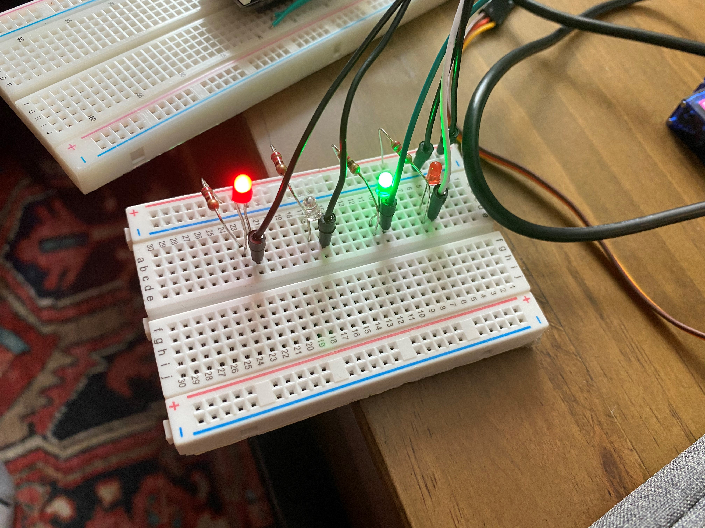

#  Skill Name

Author: Allen Zou

Date: 2020/09/18
-----

## Summary
This program completes the tasks required in skill 7. It counts binary from 0 to 15
on four leds on the bread board. There is a 1000ms delay between each new binary number.
 

## Sketches and Photos
[Video of Skill Working](https://drive.google.com/file/d/1RAPiKP6bR2SS86mGvYcB2YHcyeypE06k/preview)

## Modules, Tools, Source Used Including Attribution

## Supporting Artifacts

-----
