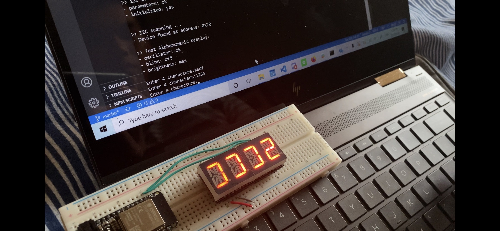
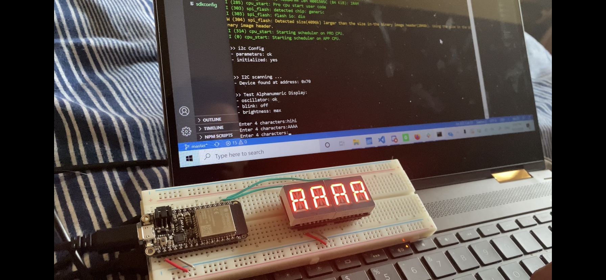
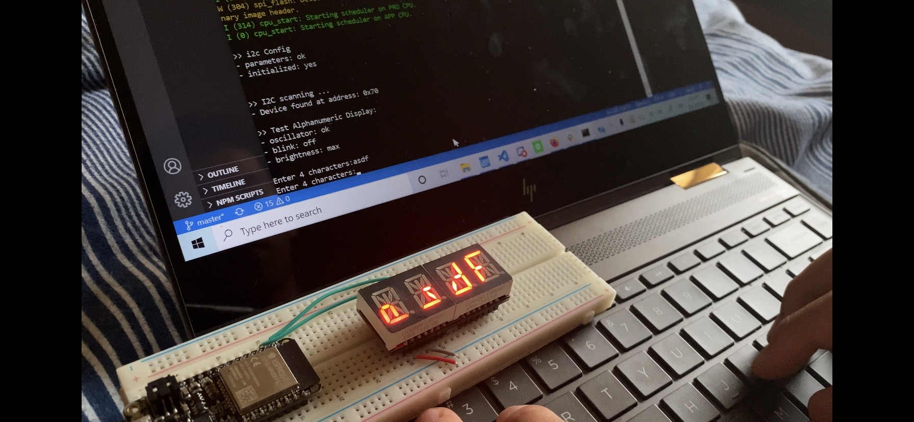

#  Skill Name

Author: Allen Zou

Date: 2020-09-17
-----

## Summary
This program satisties the tasks in the skill. It is able to
ask the user for an input of 4 characters which will then display
on the LED board after they hit enter. It uses the ADAfruit Led Backpack
github to convert characters from the I/O into the correct sequence of LED
segments to turn on. The user is then able to continuously change the display
in the monitor.

## Sketches and Photos
[Video of Skill Working](https://drive.google.com/file/d/1FpKjOP0tFEdnT3gcRd-q8q9coqEkmWGE/preview)
 
Images of the alphanumeric board:
 

## Modules, Tools, Source Used Including Attribution
https://github.com/adafruit/Adafruit_LED_Backpack

## Supporting Artifacts

-----
