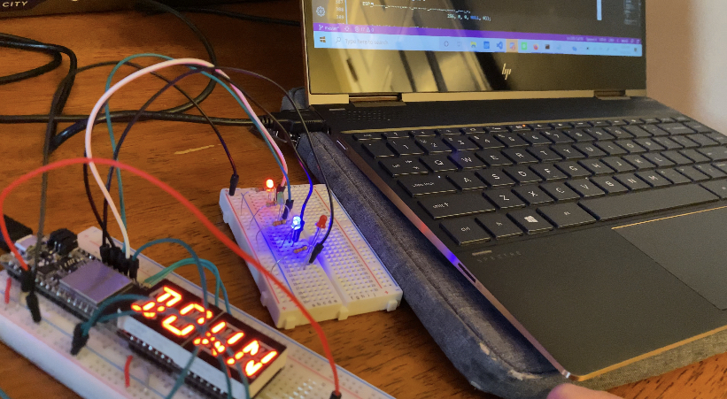
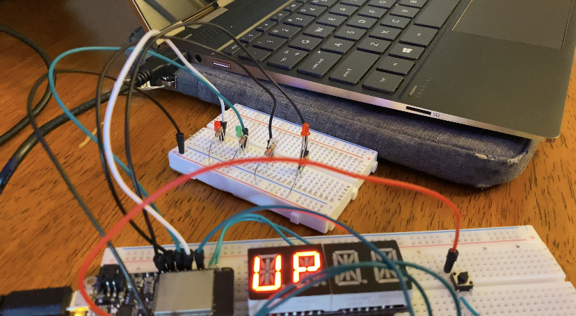

#  RTOS – Hardware interrupt

Author: Allen Zou

Date: 2020/09/22
-----

## Summary
This program accomplishes all the tasks required in skill 10. It is able to count
up and down in binary with the LED lights and can switch with the click of a button.
The I2C LED display also displays "UP" or "DOWN" in real time depending on the 
direction of counting with the LED lights.	

## Sketches and Photos
[Video of Skill Working](https://drive.google.com/file/d/1xHOPXXwqVCvQcJBreoaSsHbqQuSFQ1Hx/preview)
 
Pictures of the program working:

## Modules, Tools, Source Used Including Attribution

## Supporting Artifacts

-----
