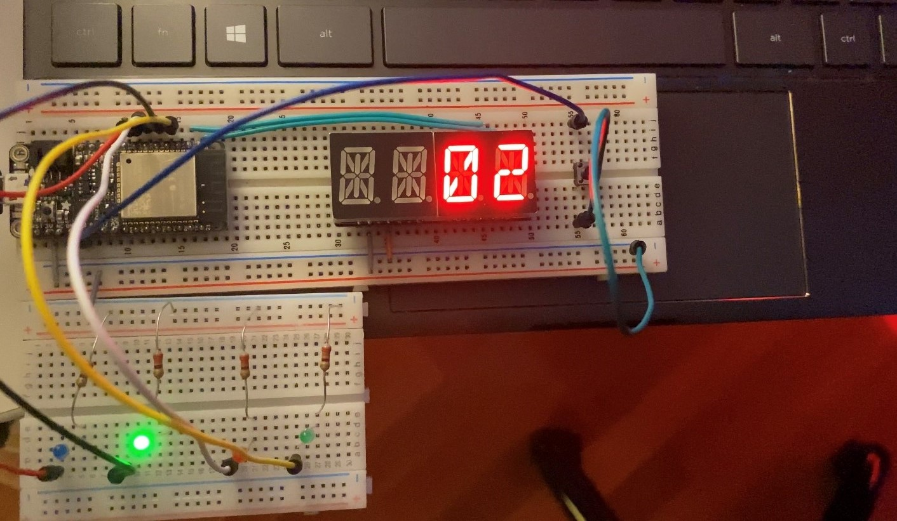
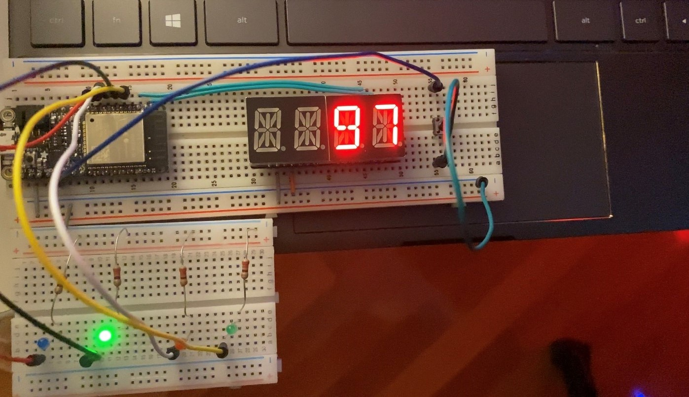

#  Stopwatch

Author: Allen Zou

Date: 2020/09/22
-----

## Summary
This program completes all the tasks required of this skill. The LED board displays 
a timer from 00-99 using timer interrupts rather than vTaskDelays. It also has the 
functionality of starting upon button press and all subsequent presses will reset the
timer back to 00. Once the timer reaches 99, it will also loop back down to 00.

## Sketches and Photos
[Video of Skill Working](https://drive.google.com/file/d/12EGoZ2rF-0H4uJj0VuHfpYsvmS1WU2Eg/preview)
 
Timer display:

## Modules, Tools, Source Used Including Attribution

## Supporting Artifacts

-----
