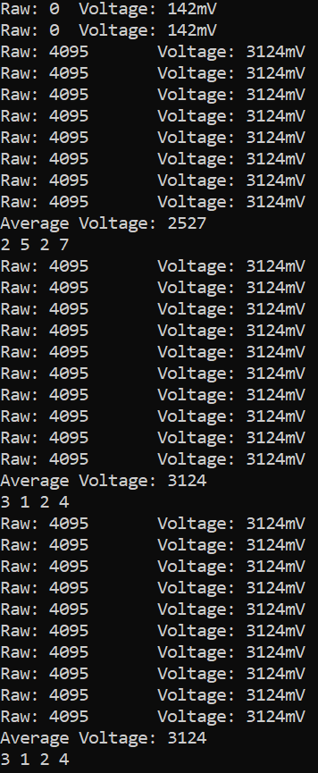

#  Battery Monitor

Author: Allen Zou

Date: 2020-10-07
-----

## Summary
This program completes all the tasks required in skill 12. It is able to read voltage on the Alphanumeric Display through the ADC pin. If the ADC pin is connected and disconnected to different segements of the voltage divider, it will display the expected value correctly.

## Sketches and Photos
[Video of Skill Working](https://drive.google.com/file/d/1CVGsGA8sBBzq37AvpP_14UJzjhQLRQuM/preview)
 
ESP terminal:
 

 
Resistor Setup:
 

## Modules, Tools, Source Used Including Attribution

## Supporting Artifacts

-----
