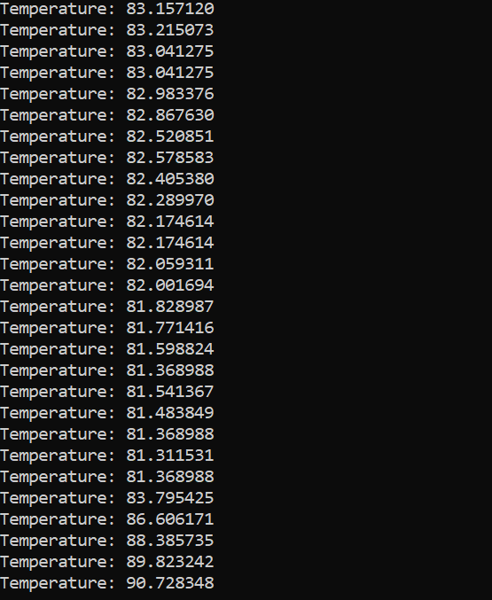
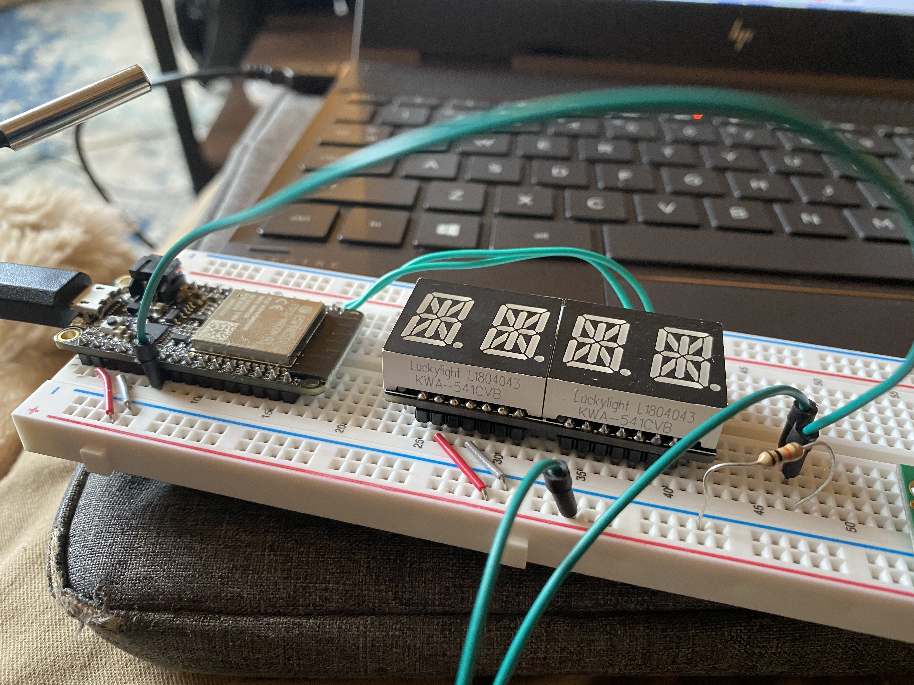

#  Thermistor

Author: Allen Zou

Date: 2020-10-07
-----

## Summary
This program completes all the tasks required in skill 13. The thermistor is connected via the ADC pin and is able to read temperature in celcius every two seconds. The thermistor is connected to power and a 10k resistor.

## Sketches and Photos
[Video of Skill Working](https://drive.google.com/file/d/19eDauN1AAXqQ1BZYnKB6k_NBq2dlIIyl/preview)
 
Terminal:
 

 
Breadboard Setup:
 

## Modules, Tools, Source Used Including Attribution
Sam Krasnoff helped me in figuring out how to convert the voltage into resistance

## Supporting Artifacts
Got the Simplified Steinhart-Hart equation from (https://learn.adafruit.com/thermistor/using-a-thermistor)

-----
