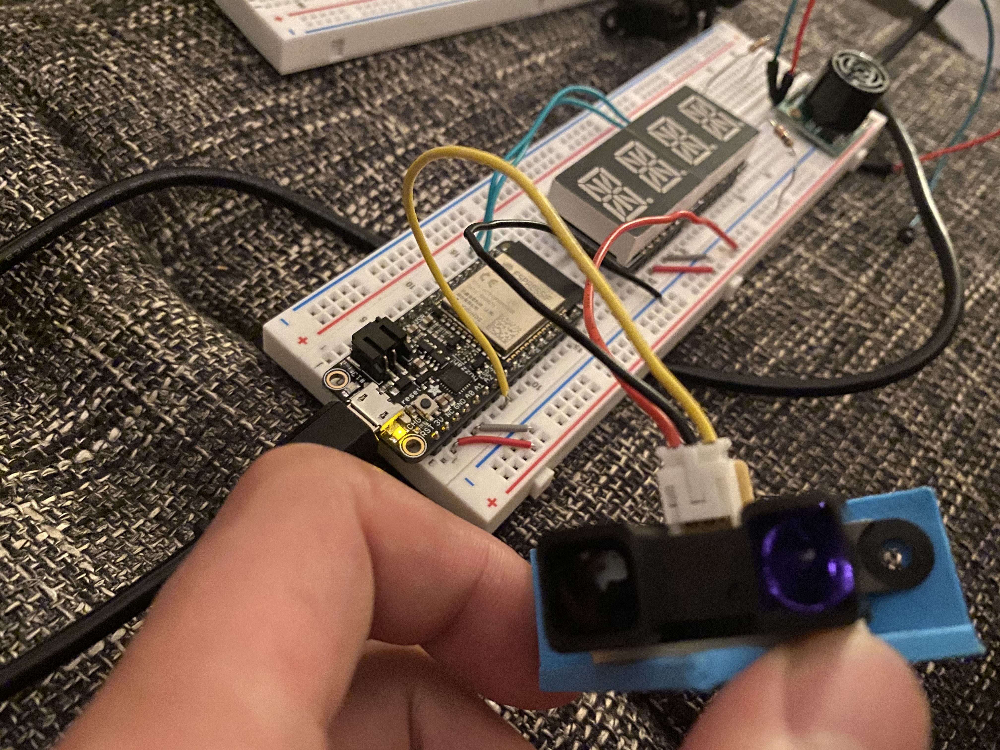
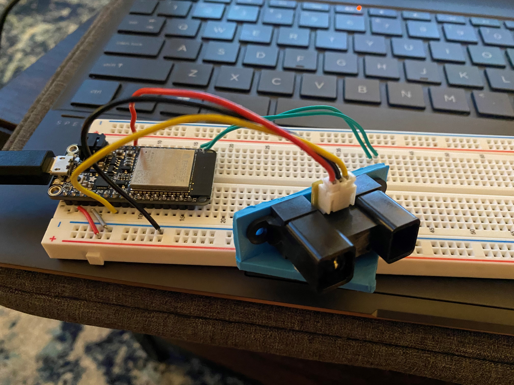

#  IR Rangefinder

Author: Allen Zou

Date: 2020-10-08
-----

## Summary
This program completes all the tasks required in this skill. The IR rangefinder is able to detect distance from the sensor every two seconds and prints it to the console.

## Sketches and Photos
[Video of Skill Working](https://drive.google.com/file/d/1X6SwhWbK7TePO05WbOjt1CEvognxONnP/preview)
 
IR Sensor Setup:
 

## Modules, Tools, Source Used Including Attribution

## Supporting Artifacts

-----
