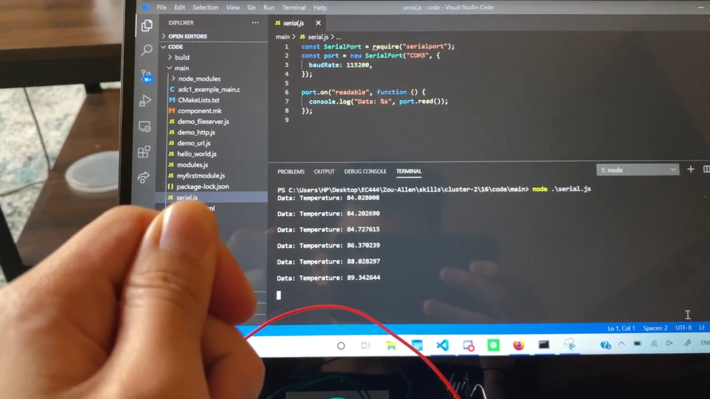
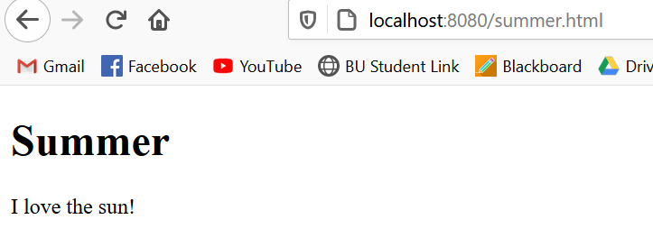

#  Node.js

Author: Allen Zou

Date: 2020-10-08
-----

## Summary
This program completes all the tasks required in this skill. I have all the tutorials from W3 schools completed and I have a serial.js file that reads data from the ESP outside of the ESP terminal.

## Sketches and Photos
[Video of Skill Working](https://drive.google.com/file/d/1xyQxfkOr7PganfefMvgsGUKUAZWiFci3/preview)
 
Serial.js working
 

 
One of the W3 tutorial files:
 

## Modules, Tools, Source Used Including Attribution

## Supporting Artifacts

-----
