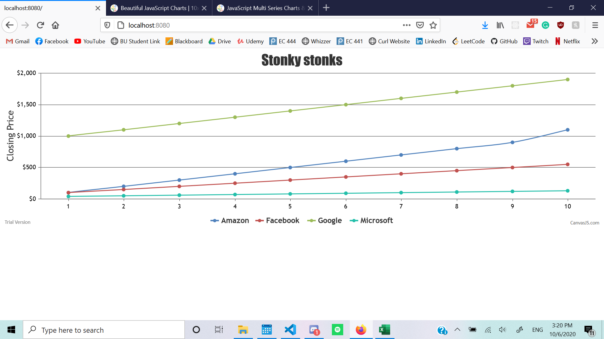
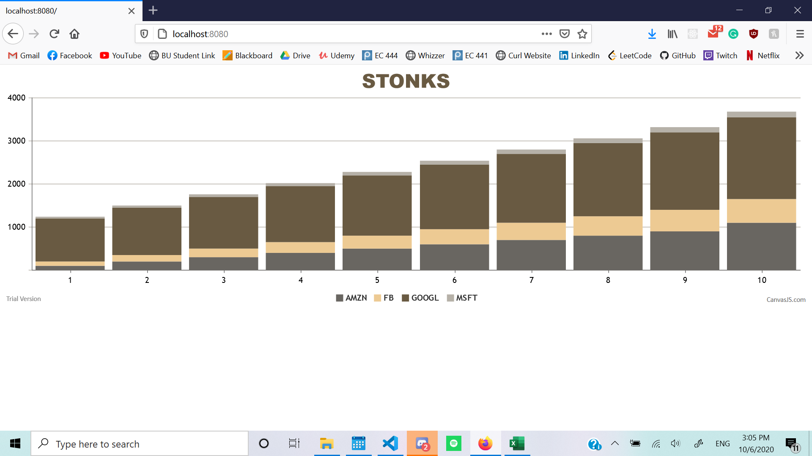

#  CanvasJS or other graphing program

Author: Allen Zou 

Date: 2020-10-08
-----

## Summary
This program completes all the tasks required in this skill. It is able to read data from a txt file in the directory and plot it on two different canvasJS chart.

## Sketches and Photos
Graph1:
 

 
Graph2:
 

## Modules, Tools, Source Used Including Attribution

## Supporting Artifacts

-----
