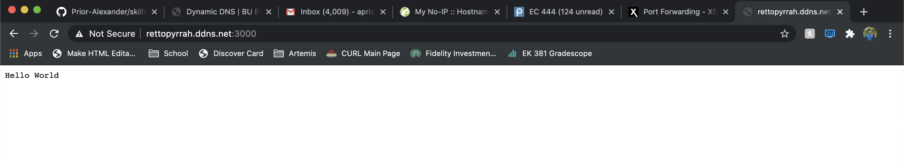

#  Dynamic DNS

Author: Allen Zou (Team Skill)

Date: 2020-10-12
-----

## Summary
For this skill, I chose no-ip.com to get a free host (rettopyrrah.ddns.net) and set the IP target to the external IP of my home router. Then, I port forwarded port 3000 to my Raspberry Pi from my home router, which is the port I am running my Hello World http server from. Now, I am able to connect to my http server and see "Hello World" from anywhere in the world, as shown below. 

## Sketches and Photos

## Video
[Click Here](https://drive.google.com/file/d/1Hhzzprif0XjO7HtkHAaR_K92_ypqFWCP/view?usp=sharing)

## Modules, Tools, Source Used Including Attribution
http, Raspberry Pi, no-ip.com, Xfinity home router

## Supporting Artifacts

-----
