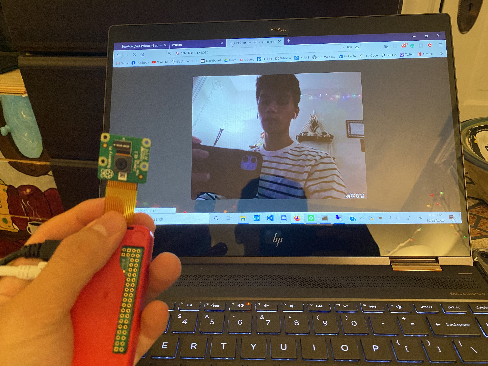

#  Pi Web Cam

Author: Allen Zou

Date: 2020-10-18
-----

## Summary
My raspberry pi completes all the tasks required in this skill. It is able to take a photo on command and streams the live webcam on port 8081 of the raspberrypi's IP.

## Sketches and Photos
[Video of Skill Working](https://drive.google.com/file/d/1l_N5TC6mNxdHccuQBRsRtZTNY-IdNJc7/preview)
 
Raspberrypi Camera Setup
 

## Modules, Tools, Source Used Including Attribution
hackster webcam tutorial: https://www.hackster.io/narender-singh/portable-video-streaming-camera-with-raspberry-pi-zero-w-dc22fd

## Supporting Artifacts

-----
