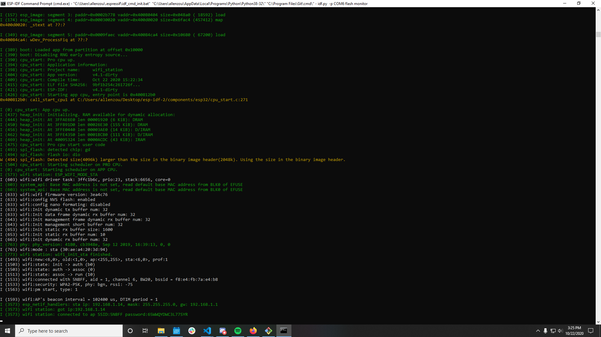

#  WiFi-ESP

Author: Allen Zou

Date: 2020-10-20
-----

## Summary
This program completes the tasks required of this skill. I was able to configure the esp to connect to my home wifi and when I run the station example, it gives me a connected response.

## Sketches and Photos
[Video of Skill Working](https://drive.google.com/file/d/1tL75e3vmIQlv0xhkIgIboZWpE7ZI_UY3/preview)
 
Terminal Output for Station Example
 

 

## Modules, Tools, Source Used Including Attribution

## Supporting Artifacts

-----
