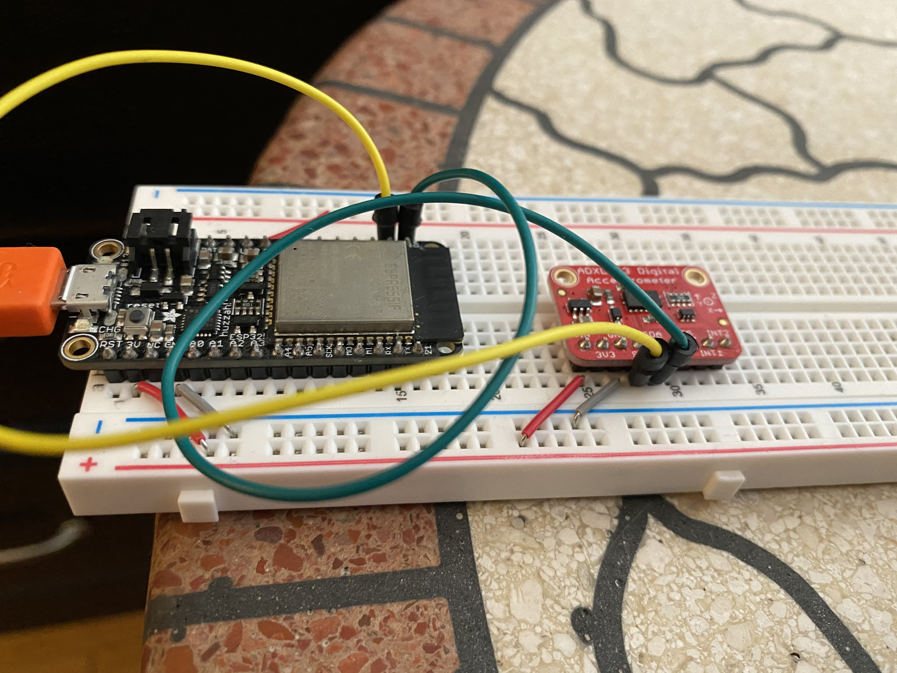

#  Accelerometer

Author: Allen Zou

Date: 2020-10-23
-----

## Summary
This program completes all the tasks require in this skill. It is able to read accelerometer data continuously and reads it to the terminal. It is able to output the X, Y, Z, Pitch, and Roll.

## Sketches and Photos
[Video of Skill Working](https://drive.google.com/file/d/1z69OQZmGcB74Mn0Ymcbh7NTm92T5iYA3/preview)
 
Accelerometer Breadboard Setup
 

## Modules, Tools, Source Used Including Attribution

## Supporting Artifacts

-----
