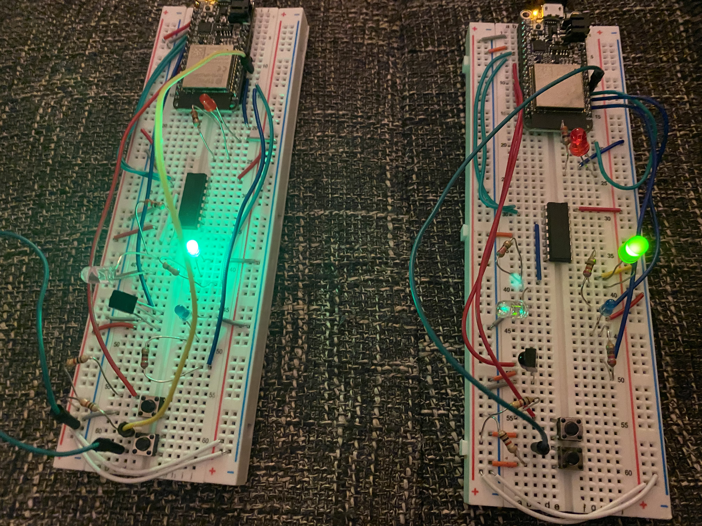

#  IR TX/RX

Author: Allen Zou

Date: 2020-11-03
-----

## Summary
This program completes all the tasks required in this skill. It is able to transmit the status of the led lights from on FOB to another and the button press will automatically change the led that is on.

## Sketches and Photos
[Video of Skill Working](https://drive.google.com/file/d/1QfP5FV8mRffrts7YgRpvjD5S4NcV_R5G/preview)
 
FOB Setup:
 

## Modules, Tools, Source Used Including Attribution

## Supporting Artifacts

-----
