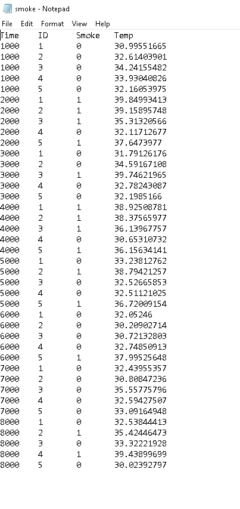

#  Databases

Author: Allen Zou

Date: 2020-11-03
-----

## Summary
This program completes all the tasks required in skill 26. It uses tingoDB to read the smoke.txt data and parse it into a JSON so that it can be uploaded to the tingoDB collection. This data can also be read using a query.

## Sketches and Photos
Smoke Data
 

 
Console Output with Data
 

## Modules, Tools, Source Used Including Attribution

## Supporting Artifacts

-----
