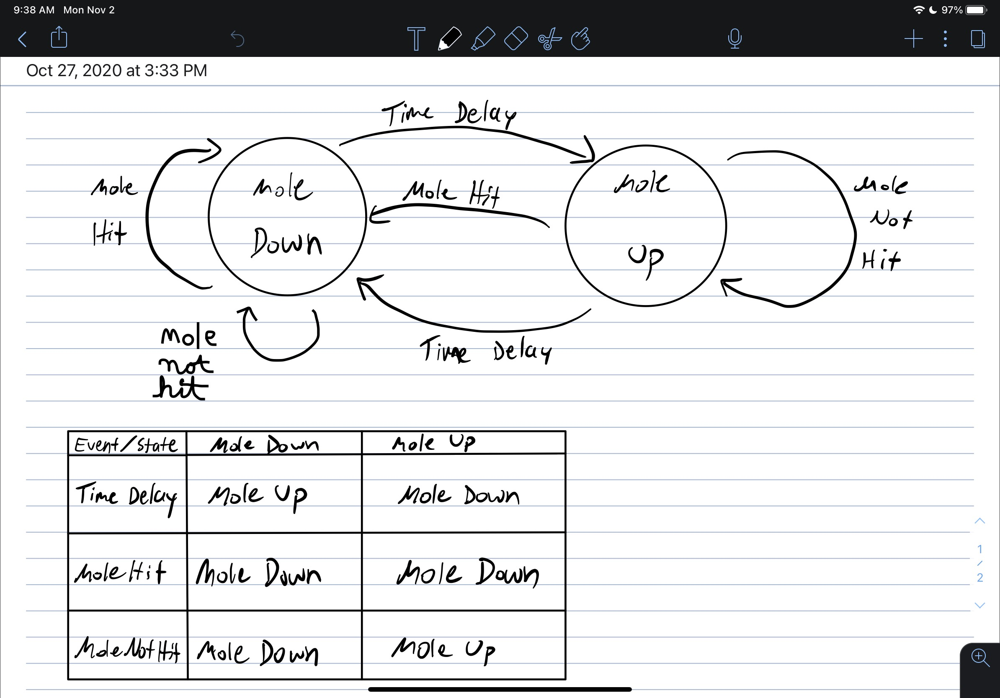

#  State Models

Author: Allen Zou

Date: 2020-11-02
-----

## Summary
This skill completes the tasks required in skill 27. We have laid out the framework for a fsm that runs a wack a mole game. We use two states, "mole up" and "mole down" and use several edges that can change the state

## Sketches and Photos
Finite State Machine Drawing
 

## Modules, Tools, Source Used Including Attribution

## Supporting Artifacts

-----
