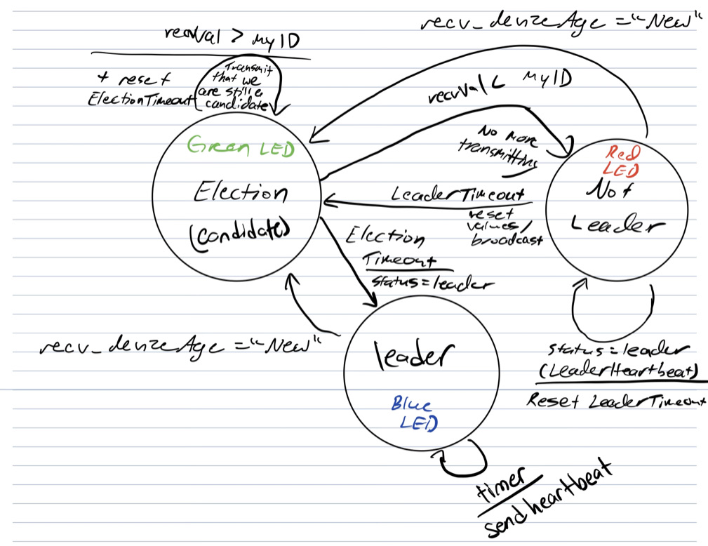
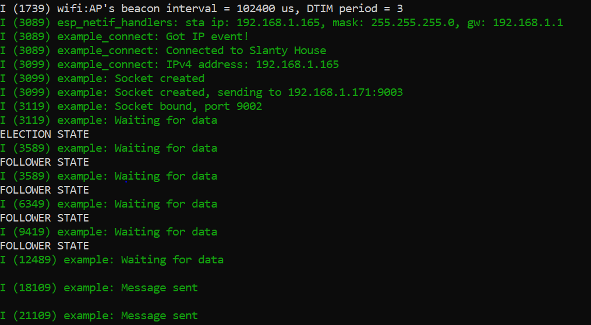
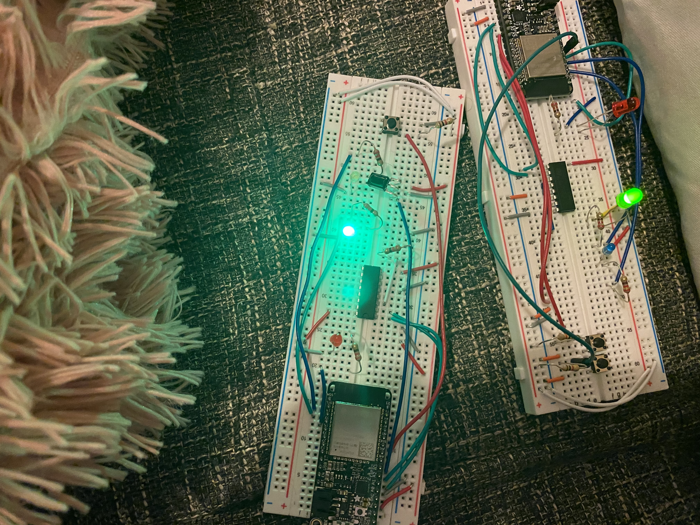
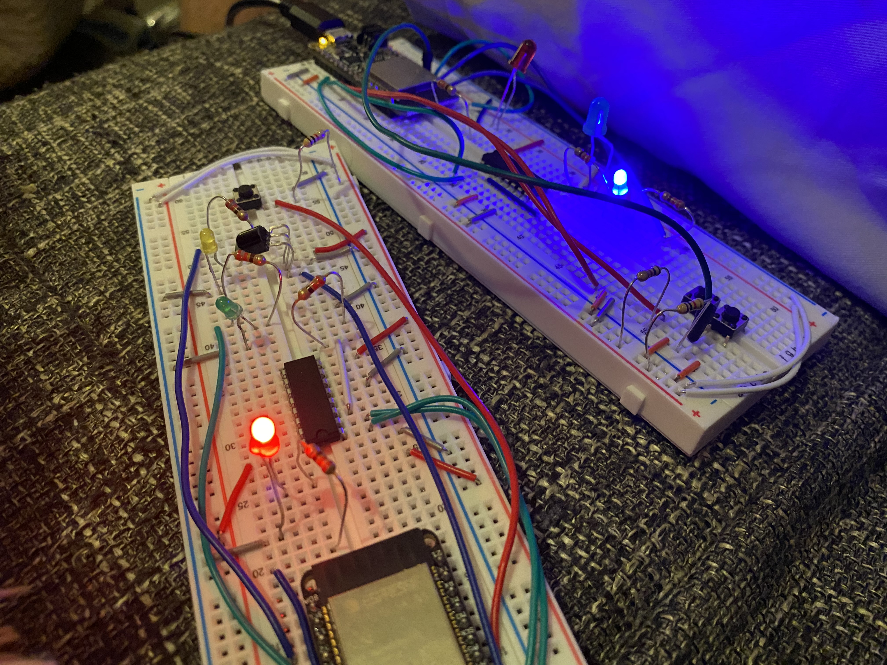

#  Leader Election

Author: Allen Zou

Date: 2020/11/11
-----

## Summary
This program completes all the tasks required in skill 28. The fob is able to communicate to two FOBs and elect a leader with the lowest ID number using a bully algorithm. (Note: The quest adds on and generalizes this code so that many FOBs can run the program simultaneously but this code only tests for two FOBs.) The program can also elect a new leader if the the current leader is "broken" or disconnected. It will also restart a leader election when a new FOB is added into the election even if the election has already started. During the election, the LED will be green. If a FOB realizes it is not a leader, its LED will turn red and if at the end of the election, the last FOB with a green led will turn blue for leader. 

## Sketches and Photos
[Video of Skill Working](https://drive.google.com/file/d/11nClcgYWpj0cwL-My4nOi-wQYwVZT67v/preview)
 
State Diagram
 

 
Terminal
 

 
Election State
 

 
Leader Found
 

## Modules, Tools, Source Used Including Attribution

## Supporting Artifacts

-----
