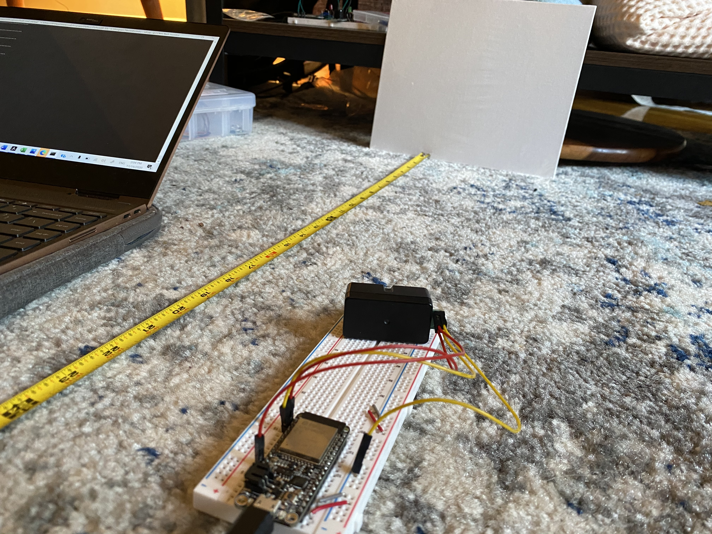
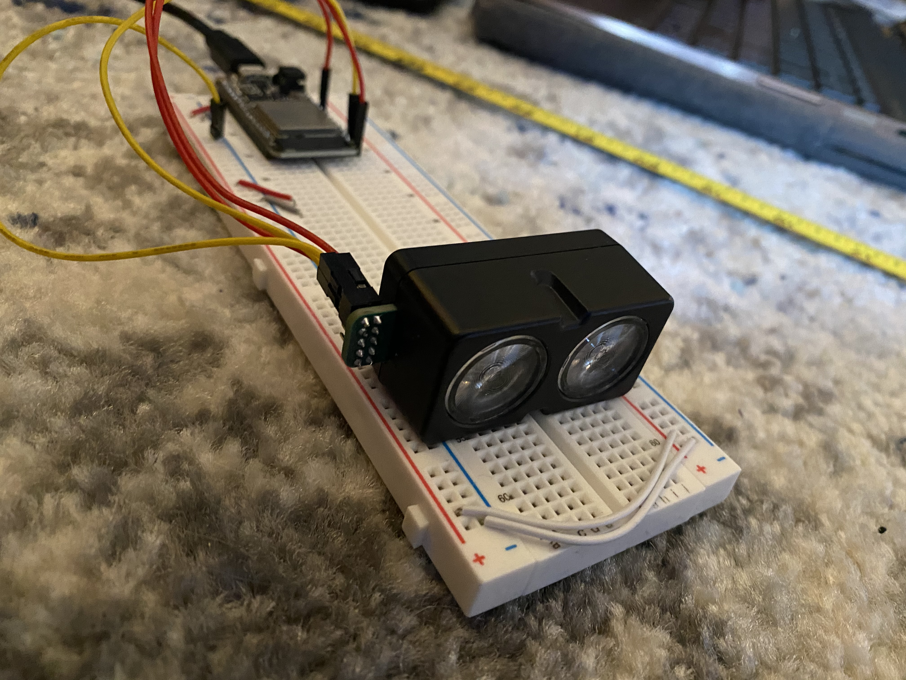

#  Lidar V4

Author: Allen Zou

Date: 2020-11-21
-----

## Summary
This program completes all the tasks required in skill 31. It uses the Garmin V4 Lidar unit and the ESP32's i2c bus to measure accurate distances that are verified using a tape measure. 

## Sketches and Photos
[Video of Skill Working](https://drive.google.com/file/d/1d47KrUaVpXFZc5M2mXnCssK2H-uaYe1T/preview)
 
Lidar Aimed at Target
 

 
Lidar Setup
 

## Modules, Tools, Source Used Including Attribution

## Supporting Artifacts

-----
