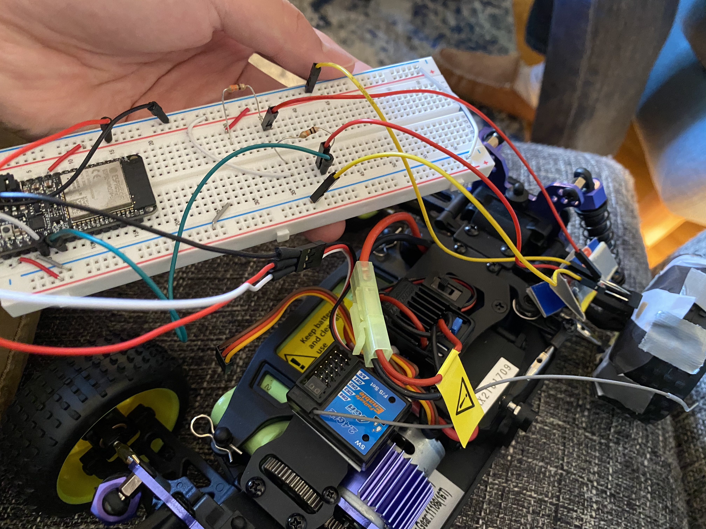
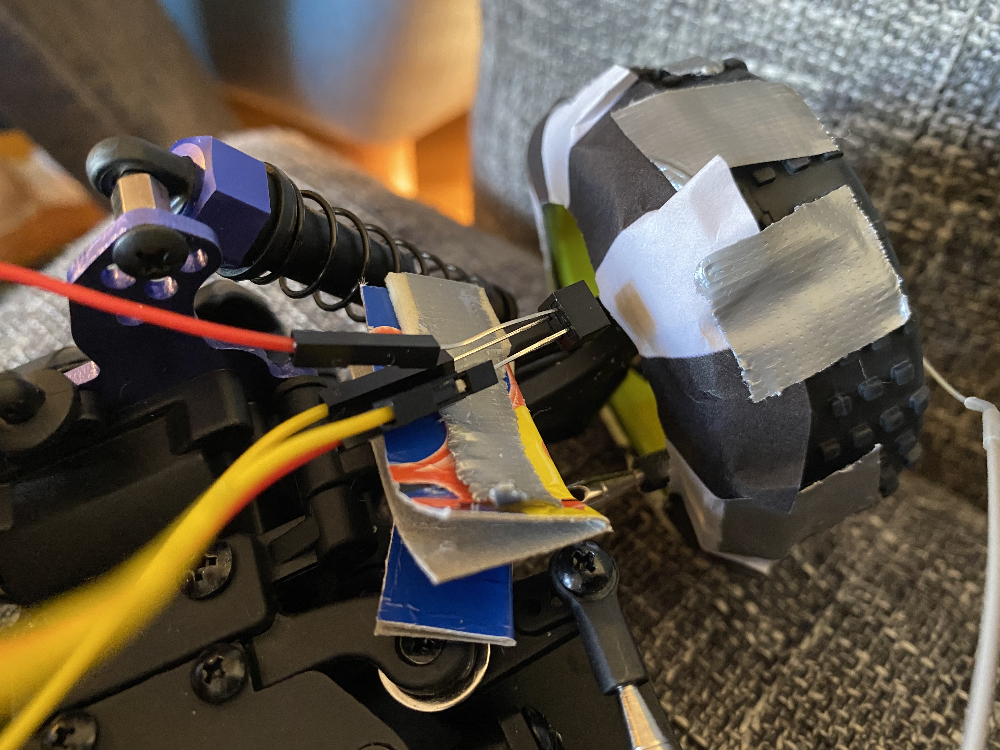
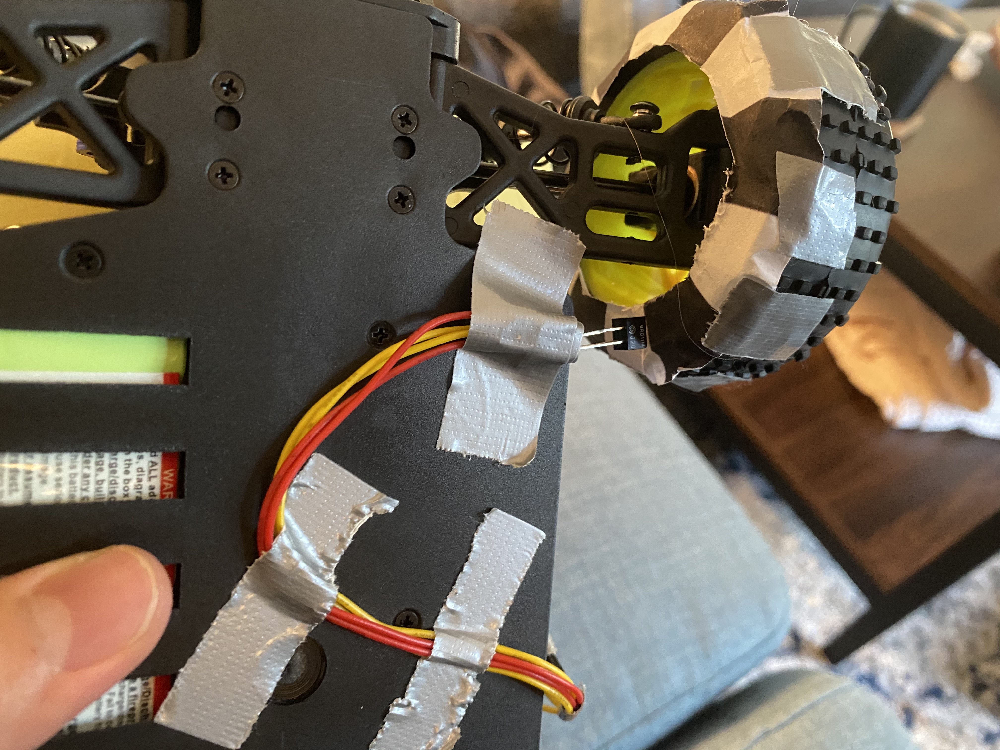

#  Wheel Speed Crawler

Author: Allen Zou

Date: 2020-11-24
-----

## Summary
This program completes all the tasks required in skill 32. We taped the black and white circle to the front wheel and are able to use the encoder to measure and output the speed of the car on the terminal. Below, I have two setups for the encoder. The first one was what we used for the skill but the second one was a revised setup that I added in during our quest since it was more stable.

## Sketches and Photos
[Video of Skill Working](https://drive.google.com/file/d/1Et-weQcvrTZ35WkH441q0HCYs0NZVelF/preview)
 
Crawler Setup
 

 
Old Encoder Setup
 

 
New Encoder Setup
 

## Modules, Tools, Source Used Including Attribution

## Supporting Artifacts

-----
