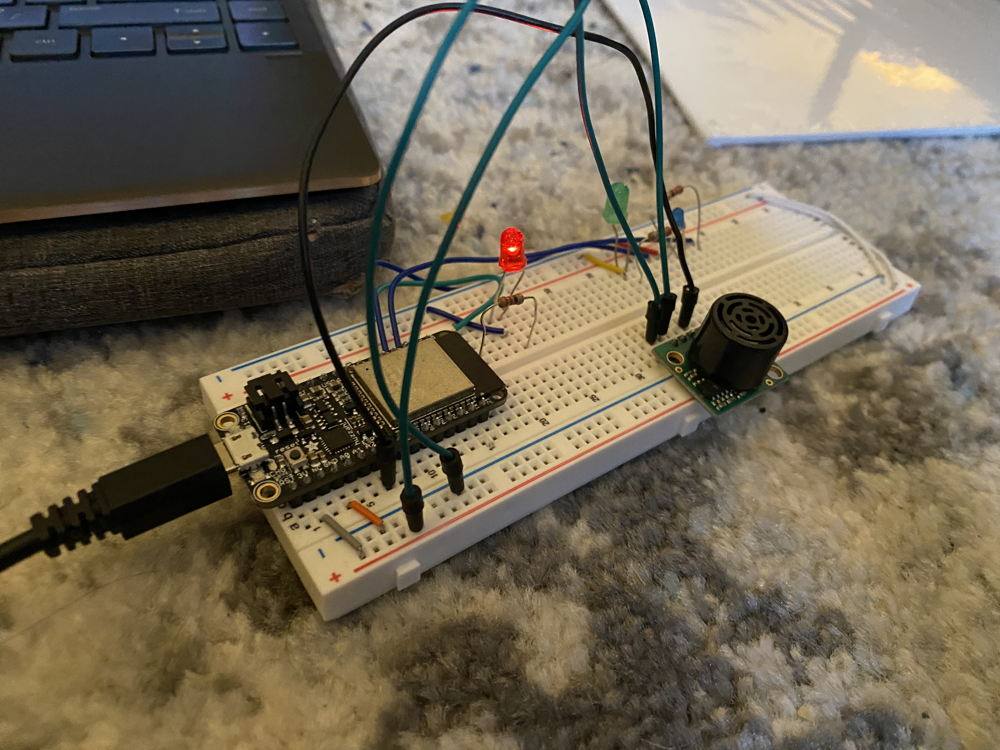

#  PID

Author: Allen Zou

Date: 2020-11-25
-----

## Summary
This program completes all the tasks required in skill 33. It uses a range sensor and a PID algorithm to detect error. If error is less than 0, the red LED is on. If the error is equal to 0, the green LED is on. And lastly, if error is less than 0, the blue LED is on. 

## Sketches and Photos
[Video of Skill Working](https://drive.google.com/file/d/15Ubg3dZlc-_0RS0pxivhIzcBohRLsfcG/preview)
 
Ultrasonic Setup
 

## Modules, Tools, Source Used Including Attribution

## Supporting Artifacts

-----
